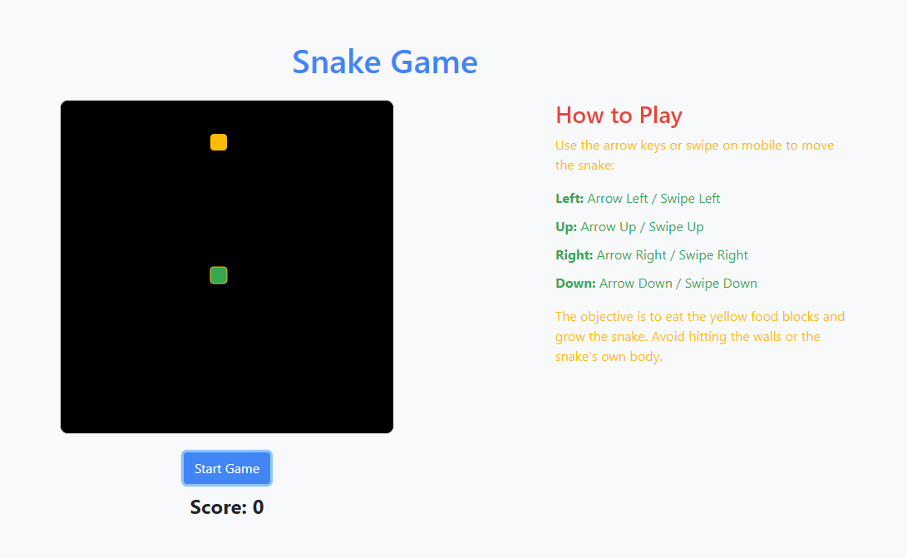

# Snake Game

## Overview

This is a simple Snake Game developed as a web application. The project demonstrates my skills in HTML, CSS, and JavaScript, and utilizes the Bootstrap framework for styling and layout.

 <!-- Add a screenshot of your game here -->

## Features

- 🐍 Classic snake game mechanics
- 📜 Instructions for playing the game
- 📱 Responsive design for desktop and mobile

## Technologies Used

- **HTML**: For structuring the game layout
- **CSS**: For styling the game and instructions
- **JavaScript**: For implementing the game logic
- **Bootstrap**: For responsive layout and styling

## How to Play

1. **Start the Game**: Click on the **Start Game** button to begin.
2. **Control the Snake**:
   - **Desktop**: Use the arrow keys to control the snake's direction.
   - **Mobile**: Swipe to control the snake's direction.
3. **Objective**: Eat the food to grow the snake and increase your score.
4. **Avoid Collisions**: Do not run into the walls or the snake's own body.

## Development

1. **HTML**: Created the structure for the game using a `canvas` element for the game area and Bootstrap for layout.
2. **CSS**: Applied custom styles to create a Google-themed design, making use of Google colors for different game elements.
3. **JavaScript**:
   - Initialized game variables and setup.
   - Implemented game mechanics including snake movement, food generation, and collision detection.
   - Added touch event listeners to support mobile gameplay.

### Folder Structure

- plaintext
├── index.html       # Main HTML file
├── style.css        # Custom CSS styles
└── script.js        # JavaScript for game logic

## Skills Demonstrated

- **Web Development**: Utilized HTML, CSS, and JavaScript to create an interactive web application.
- **Responsive Design**: Implemented a responsive layout using Bootstrap and ensured the game works on both desktop and mobile devices.
- **Game Development**: Developed game logic including player input handling, collision detection, and game state management.

## Future Enhancements

🚀 Add different levels of difficulty.
🏆 Implement a high score feature.
📱 Improve mobile controls for a better user experience.

## Author

Developed by Lee Sugano.
